# [Diagrams with Mermaid](http://mermaid.js.org)

## Flowchart

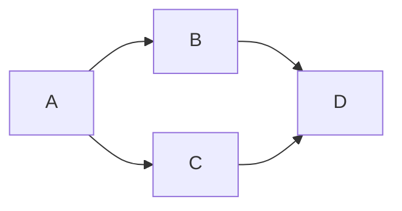
### Flowchart subgraphs
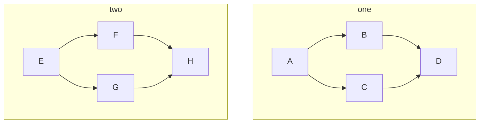

*You can use `graph` with `TB` (TB same as TD), `BT`, `RL`, `LR` to change the direction of the flowchart.* 

### Flowchart with exemplos

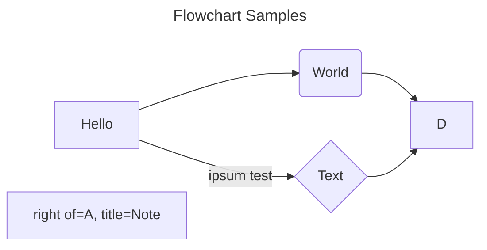

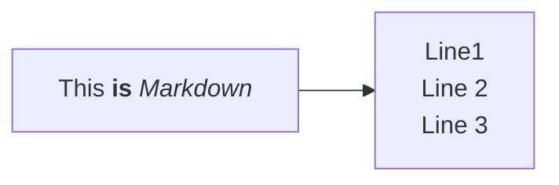
### Type of boxes

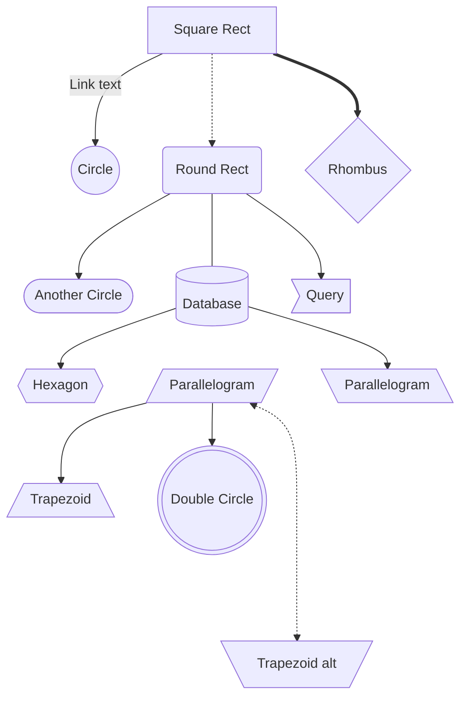
###  dotted or thick links 
Length | 1 | 2 | 3
------ | - | - | -
Normal | ---  | ---- | -----
Normal with arrow |	--> |	---> |	---->
Thick |	=== | ==== | =====
Thick with arrow | ==> | ===> |	====>
Dotted | -.- |	-..- |	-...-
Dotted with arrow |	-.-> |	-..-> |	-...->

## Flowchart with Subgraphs

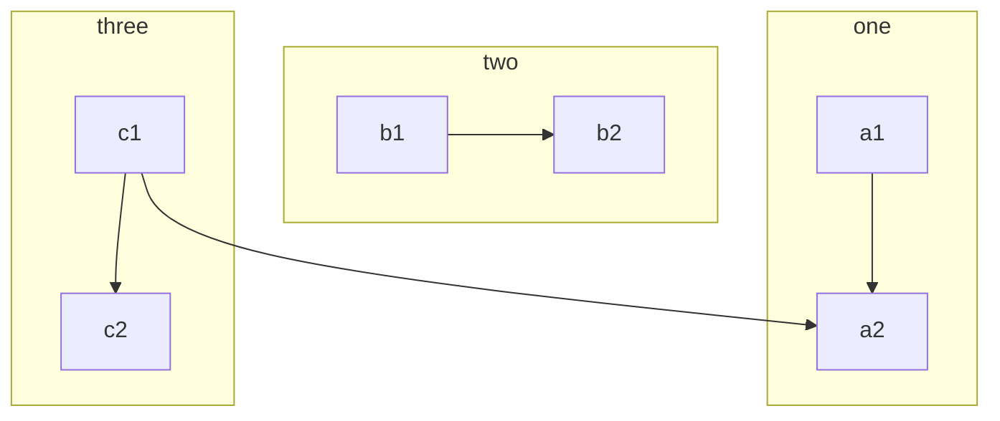

### Declarations with spaces between vertices
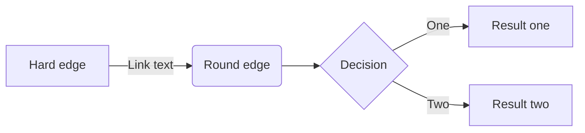

### Markdown Strings
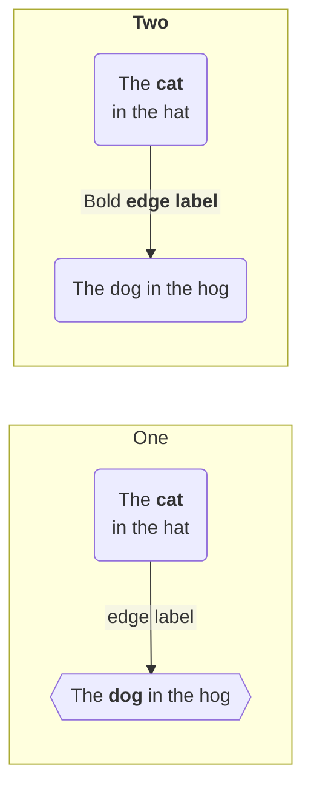

## Advanced Flowchart

### Sequence Diagram
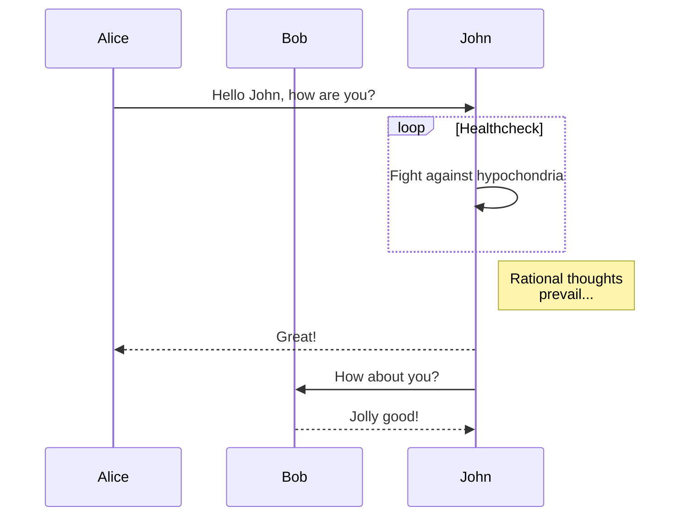

### Gantt Diagram

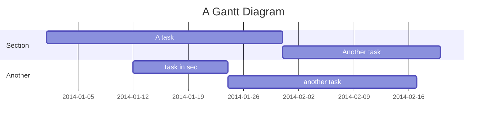

### Class Diagram

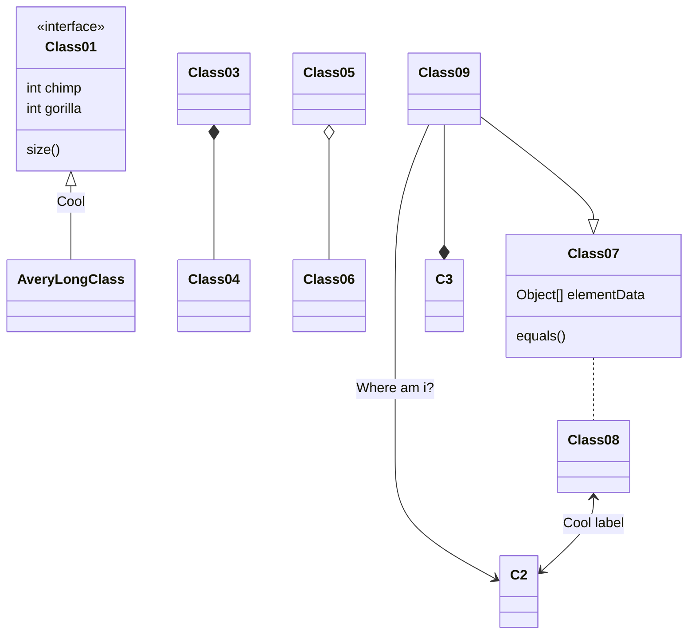

### State Diagram

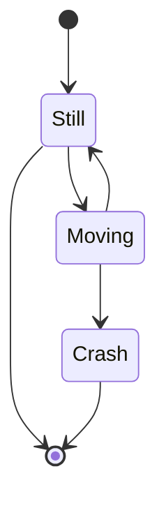